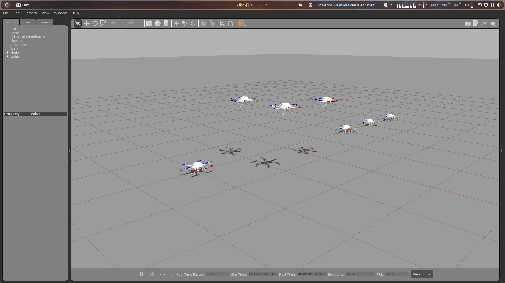

# 安装
- mavros二进制安装方式有bug,[编译安装方式参考Source installation](https://github.com/mavlink/mavros/blob/master/mavros/README.md)
- [rotors_simulator安装方式](https://github.com/ethz-asl/rotors_simulator)

## 关键步骤
```bash
wget 'https://raw.githubusercontent.com/ethz-asl/rotors_simulator/master/rotors_hil.rosinstall'
wstool merge rotors_hil.rosinstall
wstool update
```
# 启动方式

```bash
roslaunch 'rotors_simulator/rotors_gazebo/launch/firefly_swarm_hovering_example.launch' mav_name:=firefly world_name:=basic
```
# 仿真
