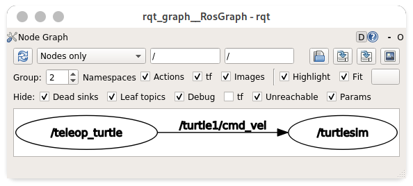
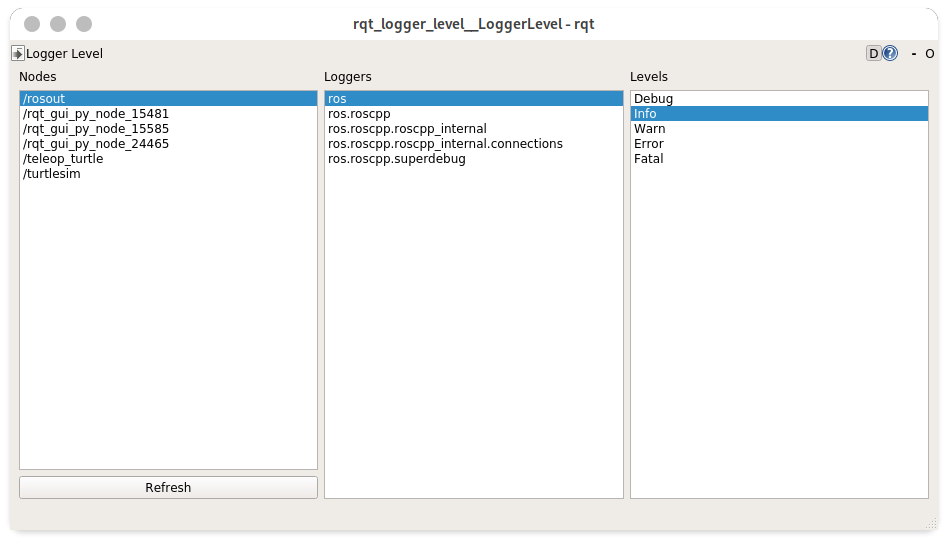
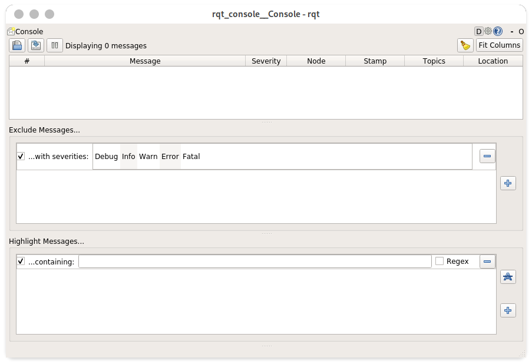

# catkin_make:构建
# `rospack`:软件包管理

## 软件包结构
    <package_name>
        CmakeLists.txt
        package.xml
[package.xml规范](http://wiki.ros.org/catkin/package.xml)
## 创建软件包
    catkin_create_pkg <package_name> [depends]...
## 查询依赖
    rospack depends <package_name>

# `rosnode`:节点管理
## 显示全部节点
    rosnode list 

## 显示节点信息
    rosnode info <node>

## 启动节点
    rosrun <package_name> <node_name>
## ping节点
    rosnode ping <node>

# `rostopic`:话题管理
[wiki](http://wiki.ros.org/cn/ROS/Tutorials/UnderstandingTopics#ROS_Messages)
## `rqt_graph`:图形工具
    rosrun rqt_graph rqt_graph

## `rostopic echo`:监听话题
    rostopic echo <topic>

## `rostopic list`:显示所有话题
    rostopic list -v

## `rostopic type`:查看话题类型
    rostopic type <topic>

## `rosmsg show`:查看类型组成
    rosmsg show <type>

## `rostopic pub`:发布消息
    rostopic pub [参数] <topic> <type> <data>

## `rostopic hz`:查看发布频率
    rostopic hz <topic>

## `rqt_plot`:实时监控数据
    rosrun rqt_plot rqt_plot
# `rosservice`:服务管理
## `rosservice list`:列出服务
    rosservice list

## `rosservice type`:显示类型
    rosservice type clear

## `rosservice call`:调用
    rosservice call <service>
## `rossr show`:查看服务详细类型
    rosservice type <serice> | rossrv show

# 参数管理
##　`rosparam list`：查看全部
    rosparam list

## `rosparam set`：设置
    rosparam set ＜param＞
## `rosparam get`：获取
    rosparam get ＜param＞

## `rosparam dump`：保存
    rosparam dump <file>
## `rosparam load`:加载
    rosparam load <file> <param>
# 日志管理
## 日志级别管理
    rosrun rqt_logger_level rqt_logger_level

## 查看日志
    rosrun rqt_console rqt_console

# `rosdep`:依赖管理 
## 安装软件包
    rosdep install [package]
# `rosbag`:话题录制回放
##　`rosbag info`:获取录制文件信息
    rosbag info　<file>
##　`rosbag play`:回放
    rosbag play <file>
## `rosbag record -a`:录制全部
    rosbag record -a
## 录制
    rosbag record -O <file> <topic>...